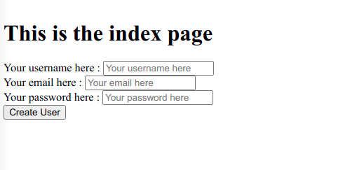

# Project-Forms

This is the project to learn about the forms on Rails.



## Built With

-   Ruby
-   Rubocop
-   Ubuntu
-   Rails

## Prerequisities

To get this project up and running locally, you must already have ruby and rails installed on your computer.

## Getting Started

**Setup**

- Clone this repository with ```git clone git@github.com:eypsrcnuygr/Project-Bare-Metal-Forms-and-Helpers.git``` using your terminal or command line.<br>
- Change to the project directory by entering ```cd Project-Bare-Metal-Forms-and-Helpers``` in the terminal<br>
- Next run ```bundle install``` to install the necessary dependencies<br>
- Run ```rails db:migrate``` to setup your local database.<br>
- Finally run ```rails server``` to start the application.<br>

## Authors

👤 **Eyüp Sercan UYGUR**

-   Github: [@eypsrcnuygr](https://github.com/eypsrcnuygr)
-   Twitter: [@eypsrcnuygr](https://twitter.com/eypsrcnuygr)
-   LinkedIn: [eypsrcnuygr](https://www.linkedin.com/in/eypsrcnuygr/)
-   Gmail: <mailto:sercanuygur@gmail.com>

👤 **Visvaldas Rapalis**

-   Github: [@visva-dev](https://github.com/visva-dev)
-   LinkedIn: [Visvaldas Rapalis](https://www.linkedin.com/in/visvaldas-rapalis/)
-   Gmail: <mailto:visva.rapalis@gmail.com>

## 🤝 Contributing

Contributions, issues and feature requests are welcome!

## Show your support

Give a ⭐️ if you like this project!

## Acknowledgments

-   This Project was part of an assignment available on The Odin Project.
-   Our thanks to Microverse and all our peers and colleagues there.

## 📝 License

This project is [MIT](lic.url) licensed.
